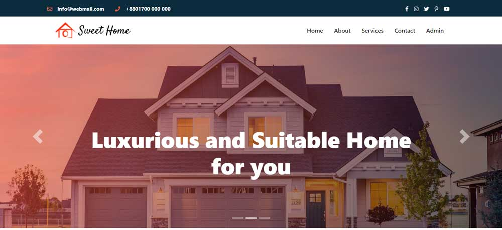

# Sweet Home - Apartment Rental Website

## Features
1. This is a house renting Website. 
2. Registered users can pay with their credit cards for renting a house and see all the details of the house.  
3. Admins can add a new house for rent service or add a new admin, delete an existing one, and edit orders that are placed by the users. 
4. Responsive on mobile and laptop.

### Front-end Technology: 
React Js, React Router, React Bootstrap, React Form, Font Awesome
### Back-end Technology: 
Node Js, Express JS, MongoDB, Redux, Firebase

### Project Live Link
[Apartment Hunt](https://apartment-hunt-14.web.app/) 
### Project Server Link
[Server Link]()